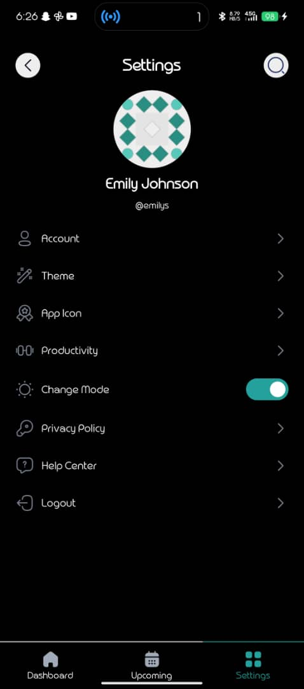
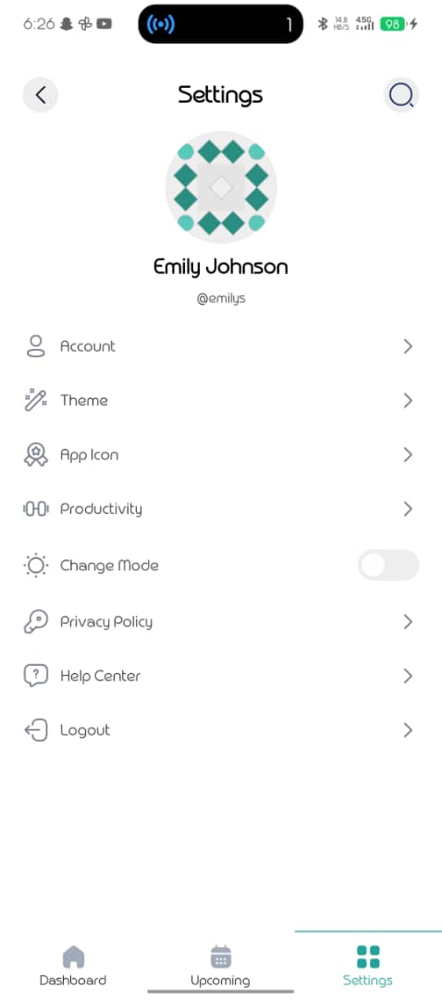
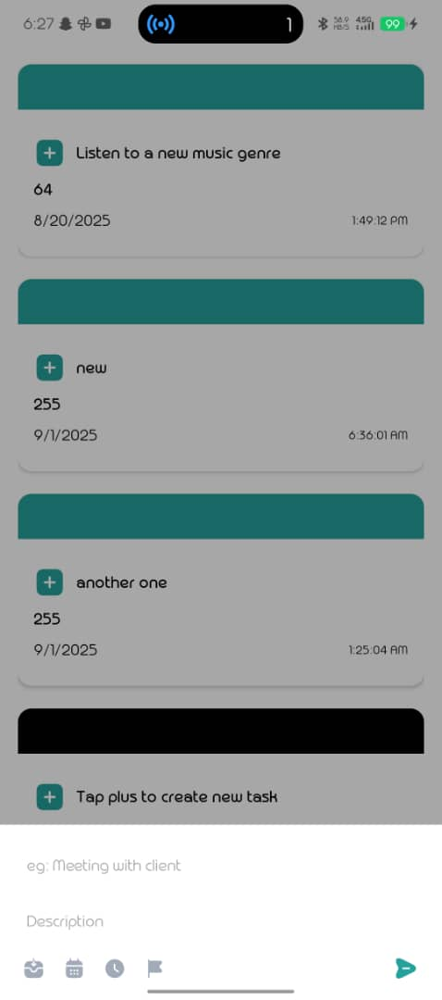
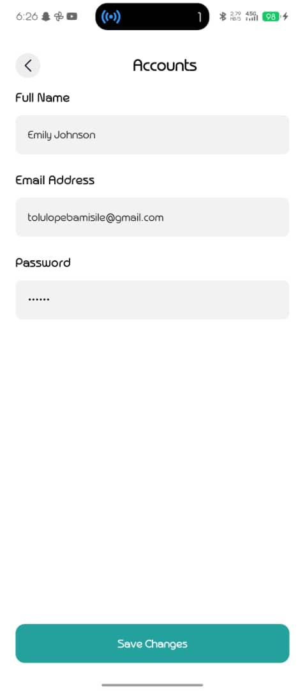
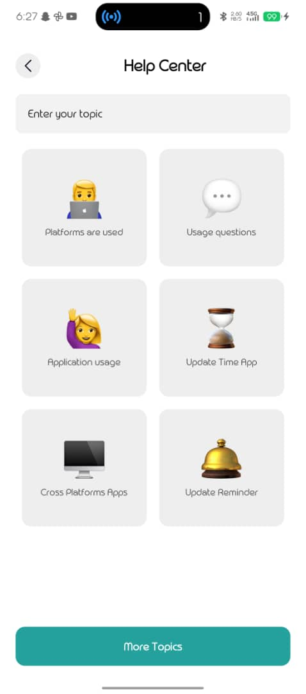
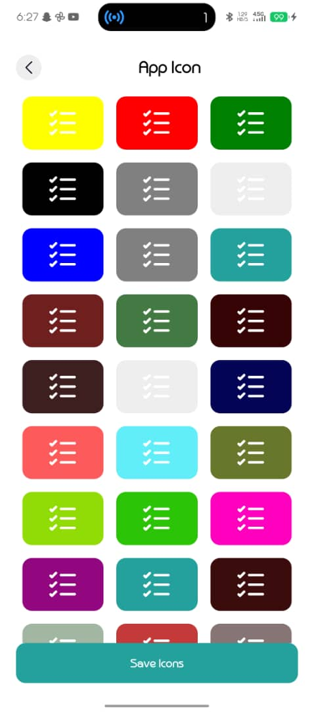
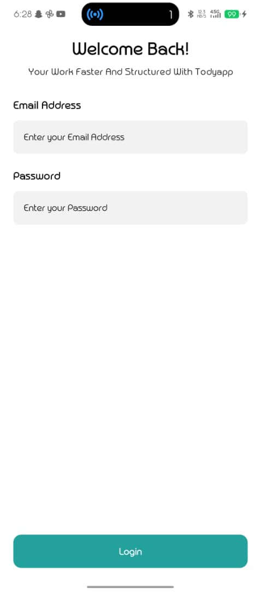

# TodoApp

A cross-platform Todo application built with React Native.

## Features

- User authentication (sign in, sign out)
- Dashboard for managing todo tasks
- Upcoming tasks screen
- Settings screen (theme, app icon, privacy, help center, logout)
- Modal for adding and editing tasks
- Theming and dark mode support
- Custom SVG icons and assets

## Project Structure

- `App.tsx` - Main entry point
- `src/component/` - Reusable UI components (e.g., Header, Input)
- `src/hooks/` - Custom hooks for authentication and todo state
- `src/screens/` - App screens:
  - `dashboardscreen.tsx` - Main dashboard for todos
  - `upcomingscreen.tsx` - Upcoming tasks and user info
  - `settingsscreen.tsx` - Settings and preferences
  - `themescreen.tsx` - Theme selection
  - `appiconscreen.tsx` - App icon selection
  - `modalscreen.tsx` - Modal for adding/editing tasks
  - `helpcenter.tsx` - Help and support
  - `accountscreen.tsx` - Account details

## Usage

1. Install dependencies:

   ```sh
   npm install
   ```

2. Run the app:

   ```sh
   npx react-native run-android
   # or
   npx react-native run-ios
   ```

## Design Choices & Assumptions

- The app uses React Native for cross-platform compatibility.
- State management is handled with Zustand for simplicity and performance.
- Screens are separated for modularity and maintainability.
- Assumes users will sign in before accessing todos.
- Theming and icon customization are provided for better user experience.

## Customization

- Change themes and app icons from the Settings screen.
- Add, edit, and view todos from the Dashboard and Modal screens.
- Access help and privacy policy from the Settings screen.

## Screenshots

### Dashboard Screen


### Upcoming Tasks Screen


### Settings Screen




### Modal



### Account Screen






## License

MIT
